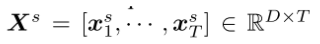

## Stock-Move-Prediction-with-Adversarial-Training-Replicate-Project

Welcome to my project page! It's time for a round of 'noise' :)

This is a replicate project to conduct experiments of paper 'Enhancing Stock Movement Prediction with Adversarial Training'.
The original paper's authors are Fuli Feng, Huimin Chen, Xiangnan He, Ji Ding, Maosong Sun and Tat-Seng Chua. The paper is linked here: https://arxiv.org/pdf/1810.09936.pdf

## Project Information
### University: Northwestern University

### Professor: Prof. Han Liu

### Project Member & Contact Information:
  
  * Yuxiang(Alvin) Chen   yuxiangchen2021 at u.northwestern.edu

### GitHub Repository:
  Here is my [GitHub Repository](https://github.com/yuxiangalvin/Stock-Move-Prediction-with-Adversarial-Training-Replicate-Project).
  
  This repo contains the codes provided by the authors and my experiment results.
  
## Relevance & Innovation

### Why

One primary group of the typical input features to stock prediction tasks are typically based on stock price, which is a stochastic variable and continuously changed with time by nature. Thus, normal training with static price-based features can easily overfit the data, being insufficient to obtain reliable models. 
This paper develops a new method of involving adversarial training into the training process of stock daily movement prediction. 

### What

The key innovation of this paper is that it proposes to employ adversarial training to improve the generalization ability of the prediction model. Specifically, it develops a method to add adversarial training into an Attentive LSTM (which is proposed for the same task in previous literatures). The authors suggest adding perturbations to simulate the stochasticity of price variable, and train the model to work well under small but intentional perturbations.

### How

Challenge of applying usual adversarial training: 

* Adding perturbations on the features of all time units can be very time-consuming
* Unintentional interactions among the perturbations of different units

Solution:
* add perturbations on the high-level prediction features of the model, before the last layer which is directly projected to the final prediction

Rationale:
* higher layers -> abstract representation
* smaller size
* efficient
* retain the stochasticity


## Model Details

### General Task
The model takes in daily price data (including daily open price, close price, high, low and adjusted close price) of a group of selected stocks (not individual stock). The data is normalized beforehand within the individual stock. Then the model treats all these normalized data from different stocks in the same way. Its aim is to train a model that could be generally used for any stock to predict whether the stock's next day's close price will be up (>0.55% movement up) or down (<-0.50% movement down) at the end of the next day compared to end of the current day. The choice of these two thresholds are not specified.

### Inputs

#### Raw Data

The raw data used is the stock daily level price data of a basket of stocks. Specifically, for each stock, daily open price, close price and adjusted price (three price values) are used between two specific dates depend on the dataset. The paper uses two different benchmark datasets used by previous papers. ACL18 & KDD17. These two datasets are the ones used by two previous papers.

#### ACL18 dataset

* ACL18 contains historical data from Jan-01-2014 to Jan01-2016 of 88 high-trade-volume-stocks in NASDAQ and NYSE markets
* Used in the paper Xu and Cohen, 2018

#### KDD17 dataset

* KDD17 contains a longer history ranging from Jan-01-2007 to Jan-01-2016 of 50 stocks in U.S. markets
* Used in the paper Zhang et al., 2017

#### Data Labelling

The paper applies the exact same method to the two dataset to label them.

The movement is calculated as the difference between the current day and next day's adjusted close price as shown in the equation below:


If the movement (from current day to next day's adjusted close) is above 0.55%, it is labelled as +1 if the movement is below -0.5%,, it is labelled as -1. Otherwise, it is labelled as 0.

The days that have the label (from current day to next day's adjusted close) 0 are removed from the data and not used.

#### Feature Generation & Normalization

The paper applies the exact same method to the two dataset for feature generation & normalization as well.

Firstly, instead of using the raw price numbers, the authors used 11 technical features that are commonly used in other papers. This process reaches two goals: 
1. normalize the prices of different stocks; 
2. explicitly capture the interaction of different prices

Here are the 11 features used:

1. c_open <- movement of the day (from open to close)
2. c_high <- not specified by the authors, according to the name, it is a feature related to daily high price
3. c_low <- not specified by the authors, according to the name, it is a feature related to daily low price
4. n_close <- movement from last day's close to current day's close price
5. n_adj_close <- movement from last day's adjusted close price to current day's adjusted close price
6-11. k-day (k=5,10,15,20,25,30) <- movement from past k day average adjusted close to current day's adjusted close price.

Here is a table of how the authors showcase them in the original paper.


Since the authors did not specify the calculation method of c_high and c_low and there is no information from source code as well (the data is preprocessed) so this creates difficulty for using other datasets for additional experiment.

The final input into the model is a D x T matrix with D = 11 (feature number), T is the number of timestpes to look back.



### Model Structure

The model contains 4 layers. Here is a picture that shows the whole structure of the model with my anotated formulas and explanations.


### Adversarial Training

Here is a picture that shows how adversarial training is applied here. As stated above, te adversarial perturbation is added at the higher level, sepcifically after the temporal attention layer before the prediction layer.

#### Adversarial Perturbation Generation

The following two formulas show how e_adv is generated from the original e.


As the formula show, calculated perturbation is the gradient of loss function regarding the latent representation e. Thus, the direction of adding noise is the direction where loss function increases the most at  the given point e.

This benefit2 the model to predict correctly predict samples drawn from the inherent stochastic distribution of inputs, capturing the stochasticity

#### Involve Perturbation

The generated new adversarial e is considered as an input that should lead to similar predictions. Thus, it is invovled as a new term in the loss function.

The graph below shows how two separate runs of the last prediction layer on e and adversarial e are conducted and the loss involve both terms with a weight parameter beta.


The original loss functions of an Attentive LSTM model and the Adversarial Attentive LSTM model are shown below with each term labelled. 


Alpha is a paramter to weight regularizer loss term. So the loss function involves two weight parameters, alpha and beta.

## My Experiments & Codes

### Import Libraries
```python
import argparse
import copy
import numpy as np
import os
import random
from sklearn.utils import shuffle
import tensorflow as tf
from time import time

from tensorflow.python.ops.nn_ops import leaky_relu
from load import load_cla_data
```

### Model & Traning
```python
class AWLSTM:
    def __init__(self, data_path, model_path, model_save_path, parameters, steps=1, epochs=50,
                 batch_size=256, gpu=False, tra_date='2014-01-02',
                 val_date='2015-08-03', tes_date='2015-10-01', att=0, hinge=0,
                 fix_init=0, adv=0, reload=0):
        self.data_path = data_path
        self.model_path = model_path
        self.model_save_path = model_save_path
        # model parameters
        self.paras = copy.copy(parameters)
        # training parameters
        self.steps = steps
        self.epochs = epochs
        self.batch_size = batch_size
        self.gpu = gpu

        if att == 1:
            self.att = True
        else:
            self.att = False
        if hinge == 1:
            self.hinge = True
        else:
            self.hinge = False
        if fix_init == 1:
            self.fix_init = True
        else:
            self.fix_init = False
        if adv == 1:
            self.adv_train = True
        else:
            self.adv_train = False
        if reload == 1:
            self.reload = True
        else:
            self.reload = False

        # load data
        self.tra_date = tra_date
        self.val_date = val_date
        self.tes_date = tes_date
        self.tra_pv, self.tra_wd, self.tra_gt, \
        self.val_pv, self.val_wd, self.val_gt, \
        self.tes_pv, self.tes_wd, self.tes_gt = load_cla_data(
            self.data_path,
            tra_date, val_date, tes_date, seq=self.paras['seq']
        )
        self.fea_dim = self.tra_pv.shape[2]

    def get_batch(self, sta_ind=None):
        if sta_ind is None:
            sta_ind = random.randrange(0, self.tra_pv.shape[0])
        if sta_ind + self.batch_size < self.tra_pv.shape[0]:
            end_ind = sta_ind + self.batch_size
        else:
            sta_ind = self.tra_pv.shape[0] - self.batch_size
            end_ind = self.tra_pv.shape[0]
        return self.tra_pv[sta_ind:end_ind, :, :], \
               self.tra_wd[sta_ind:end_ind, :, :], \
               self.tra_gt[sta_ind:end_ind, :]

    def adv_part(self, adv_inputs):
        print('adversial part')
        if self.att:
            with tf.variable_scope('pre_fc'):
                self.fc_W = tf.get_variable(
                    'weights', dtype=tf.float32,
                    shape=[self.paras['unit'] * 2, 1],
                    initializer=tf.glorot_uniform_initializer()
                )
                self.fc_b = tf.get_variable(
                    'biases', dtype=tf.float32,
                    shape=[1, ],
                    initializer=tf.zeros_initializer()
                )
                if self.hinge:
                    pred = tf.nn.bias_add(
                        tf.matmul(adv_inputs, self.fc_W), self.fc_b
                    )
                else:
                    pred = tf.nn.sigmoid(
                        tf.nn.bias_add(tf.matmul(self.fea_con, self.fc_W),
                                       self.fc_b)
                    )
        else:
            # One hidden layer
            if self.hinge:
                pred = tf.layers.dense(
                    adv_inputs, units=1, activation=None,
                    name='pre_fc',
                    kernel_initializer=tf.glorot_uniform_initializer()
                )
            else:
                pred = tf.layers.dense(
                    adv_inputs, units=1, activation=tf.nn.sigmoid,
                    name='pre_fc',
                    kernel_initializer=tf.glorot_uniform_initializer()
                )
        return pred

    def construct_graph(self):
        print('is pred_lstm')
        if self.gpu == True:
            device_name = '/gpu:0'
        else:
            device_name = '/cpu:0'
        print('device name:', device_name)
        with tf.device(device_name):
            tf.reset_default_graph()
            if self.fix_init:
                tf.set_random_seed(123456)

            self.gt_var = tf.placeholder(tf.float32, [None, 1])
            self.pv_var = tf.placeholder(
                tf.float32, [None, self.paras['seq'], self.fea_dim]
            )
            self.wd_var = tf.placeholder(
                tf.float32, [None, self.paras['seq'], 5]
            )

            self.lstm_cell = tf.contrib.rnn.BasicLSTMCell(
                self.paras['unit']
            )

            # self.outputs, _ = tf.nn.dynamic_rnn(
            #     # self.outputs, _ = tf.nn.static_rnn(
            #     self.lstm_cell, self.pv_var, dtype=tf.float32
            #     # , initial_state=ini_sta
            # )

            self.in_lat = tf.layers.dense(
                self.pv_var, units=self.fea_dim,
                activation=tf.nn.tanh, name='in_fc',
                kernel_initializer=tf.glorot_uniform_initializer()
            )

            self.outputs, _ = tf.nn.dynamic_rnn(
                # self.outputs, _ = tf.nn.static_rnn(
                self.lstm_cell, self.in_lat, dtype=tf.float32
                # , initial_state=ini_sta
            )

            self.loss = 0
            self.adv_loss = 0
            self.l2_norm = 0
            if self.att:
                with tf.variable_scope('lstm_att') as scope:
                    self.av_W = tf.get_variable(
                        name='att_W', dtype=tf.float32,
                        shape=[self.paras['unit'], self.paras['unit']],
                        initializer=tf.glorot_uniform_initializer()
                    )
                    self.av_b = tf.get_variable(
                        name='att_h', dtype=tf.float32,
                        shape=[self.paras['unit']],
                        initializer=tf.zeros_initializer()
                    )
                    self.av_u = tf.get_variable(
                        name='att_u', dtype=tf.float32,
                        shape=[self.paras['unit']],
                        initializer=tf.glorot_uniform_initializer()
                    )

                    self.a_laten = tf.tanh(
                        tf.tensordot(self.outputs, self.av_W,
                                     axes=1) + self.av_b)
                    self.a_scores = tf.tensordot(self.a_laten, self.av_u,
                                                 axes=1,
                                                 name='scores')
                    self.a_alphas = tf.nn.softmax(self.a_scores, name='alphas')

                    self.a_con = tf.reduce_sum(
                        self.outputs * tf.expand_dims(self.a_alphas, -1), 1)
                    self.fea_con = tf.concat(
                        [self.outputs[:, -1, :], self.a_con],
                        axis=1)
                    print('adversarial scope')
                    # training loss
                    self.pred = self.adv_part(self.fea_con)
                    if self.hinge:
                        self.loss = tf.losses.hinge_loss(self.gt_var, self.pred)
                    else:
                        self.loss = tf.losses.log_loss(self.gt_var, self.pred)

                    self.adv_loss = self.loss * 0

                    # adversarial loss
                    if self.adv_train:
                        print('gradient noise')
                        self.delta_adv = tf.gradients(self.loss, [self.fea_con])[0]
                        tf.stop_gradient(self.delta_adv)
                        self.delta_adv = tf.nn.l2_normalize(self.delta_adv, axis=1)
                        self.adv_pv_var = self.fea_con + \
                                          self.paras['eps'] * self.delta_adv

                        scope.reuse_variables()
                        self.adv_pred = self.adv_part(self.adv_pv_var)
                        if self.hinge:
                            self.adv_loss = tf.losses.hinge_loss(self.gt_var, self.adv_pred)
                        else:
                            self.adv_loss = tf.losses.log_loss(self.gt_var, self.adv_pred)
            else:
                with tf.variable_scope('lstm_att') as scope:
                    print('adversarial scope')
                    # training loss
                    self.pred = self.adv_part(self.outputs[:, -1, :])
                    if self.hinge:
                        self.loss = tf.losses.hinge_loss(self.gt_var, self.pred)
                    else:
                        self.loss = tf.losses.log_loss(self.gt_var, self.pred)

                    self.adv_loss = self.loss * 0

                    # adversarial loss
                    if self.adv_train:
                        print('gradient noise')
                        self.delta_adv = tf.gradients(self.loss, [self.outputs[:, -1, :]])[0]
                        tf.stop_gradient(self.delta_adv)
                        self.delta_adv = tf.nn.l2_normalize(self.delta_adv,
                                                            axis=1)
                        self.adv_pv_var = self.outputs[:, -1, :] + \
                                          self.paras['eps'] * self.delta_adv

                        scope.reuse_variables()
                        self.adv_pred = self.adv_part(self.adv_pv_var)
                        if self.hinge:
                            self.adv_loss = tf.losses.hinge_loss(self.gt_var,
                                                                 self.adv_pred)
                        else:
                            self.adv_loss = tf.losses.log_loss(self.gt_var,
                                                               self.adv_pred)

            # regularizer
            self.tra_vars = tf.trainable_variables('lstm_att/pre_fc')
            for var in self.tra_vars:
                self.l2_norm += tf.nn.l2_loss(var)

            self.obj_func = self.loss + \
                            self.paras['alp'] * self.l2_norm + \
                            self.paras['bet'] * self.adv_loss

            self.optimizer = tf.train.AdamOptimizer(
                learning_rate=self.paras['lr']
            ).minimize(self.obj_func)


    def train(self, tune_para=True):
        self.construct_graph()

        sess = tf.Session()
        saver = tf.train.Saver()
        if self.reload:
            saver.restore(sess, self.model_path)
#             print('model restored')
        else:
            sess.run(tf.global_variables_initializer())

        best_valid_pred = np.zeros(self.val_gt.shape, dtype=float)
        best_test_pred = np.zeros(self.tes_gt.shape, dtype=float)

        best_valid_perf = {
            'acc': 0, 'mcc': -2
        }
        best_test_perf = {
            'acc': 0, 'mcc': -2
        }

        bat_count = self.tra_pv.shape[0] // self.batch_size
        if not (self.tra_pv.shape[0] % self.batch_size == 0):
            bat_count += 1
        for i in range(self.epochs):
            t1 = time()
            # first_batch = True
            tra_loss = 0.0
            tra_obj = 0.0
            l2 = 0.0
            tra_adv = 0.0
            for j in range(bat_count):
                pv_b, wd_b, gt_b = self.get_batch(j * self.batch_size)
                feed_dict = {
                    self.pv_var: pv_b,
                    self.wd_var: wd_b,
                    self.gt_var: gt_b
                }
                cur_pre, cur_obj, cur_loss, cur_l2, cur_al, batch_out = sess.run(
                    (self.pred, self.obj_func, self.loss, self.l2_norm, self.adv_loss,
                     self.optimizer),
                    feed_dict
                )

                tra_loss += cur_loss
                tra_obj += cur_obj
                l2 += cur_l2
                tra_adv += cur_al
#             print('----->>>>> Training:', tra_obj / bat_count,
#                   tra_loss / bat_count, l2 / bat_count, tra_adv / bat_count)

            if not tune_para:
                tra_loss = 0.0
                tra_obj = 0.0
                l2 = 0.0
                tra_acc = 0.0
                for j in range(bat_count):
                    pv_b, wd_b, gt_b = self.get_batch(
                        j * self.batch_size)
                    feed_dict = {
                        self.pv_var: pv_b,
                        self.wd_var: wd_b,
                        self.gt_var: gt_b
                    }
                    cur_obj, cur_loss, cur_l2, cur_pre = sess.run(
                        (self.obj_func, self.loss, self.l2_norm, self.pred),
                        feed_dict
                    )
                    cur_tra_perf = evaluate(cur_pre, gt_b, self.hinge)
                    tra_loss += cur_loss
                    l2 += cur_l2
                    tra_obj += cur_obj
                    tra_acc += cur_tra_perf['acc']
#                 print('Training:', tra_obj / bat_count, tra_loss / bat_count,
#                       l2 / bat_count, '\tTrain per:', tra_acc / bat_count)

            # test on validation set
            feed_dict = {
                self.pv_var: self.val_pv,
                self.wd_var: self.val_wd,
                self.gt_var: self.val_gt
            }
            val_loss, val_pre = sess.run(
                (self.loss, self.pred), feed_dict
            )
            cur_valid_perf = evaluate(val_pre, self.val_gt, self.hinge)
#             print('\tVal per:', cur_valid_perf, '\tVal loss:', val_loss)

            # test on testing set
            feed_dict = {
                self.pv_var: self.tes_pv,
                self.wd_var: self.tes_wd,
                self.gt_var: self.tes_gt
            }
            test_loss, tes_pre = sess.run(
                (self.loss, self.pred), feed_dict
            )
            cur_test_perf = evaluate(tes_pre, self.tes_gt, self.hinge)
#             print('\tTest per:', cur_test_perf, '\tTest loss:', test_loss)

            if cur_valid_perf['acc'] > best_valid_perf['acc']:
                best_valid_perf = copy.copy(cur_valid_perf)
                best_valid_pred = copy.copy(val_pre)
                best_test_perf = copy.copy(cur_test_perf)
                best_test_pred = copy.copy(tes_pre)
                if not tune_para:
                    saver.save(sess, self.model_save_path)
            self.tra_pv, self.tra_wd, self.tra_gt = shuffle(
                self.tra_pv, self.tra_wd, self.tra_gt, random_state=0
            )
            t4 = time()
#             print('epoch:', i, ('time: %.4f ' % (t4 - t1)))
#         print('\nBest Valid performance:', best_valid_perf)
#         print('\tBest Test performance:', best_test_perf)
        sess.close()
        tf.reset_default_graph()
        print(best_valid_perf['acc'])
        print(best_valid_perf['mcc'])
        if tune_para:
            return best_valid_perf, best_test_perf
        return best_valid_pred, best_test_pred
```

### Input Parser & Run
```python
if __name__ == '__main__':
    desc = 'the lstm model'
    parser = argparse.ArgumentParser(description=desc)
    parser.add_argument('-p', '--path', help='path of pv data', type=str,
                        default='./data/stocknet-dataset/price/ourpped')
    parser.add_argument('-l', '--seq', help='length of history', type=int,
                        default=5)
    parser.add_argument('-u', '--unit', help='number of hidden units in lstm',
                        type=int, default=32)
    parser.add_argument('-l2', '--alpha_l2', type=float, default=1e-2,
                        help='alpha for l2 regularizer')
    parser.add_argument('-la', '--beta_adv', type=float, default=1e-2,
                        help='beta for adverarial loss')
    parser.add_argument('-le', '--epsilon_adv', type=float, default=1e-2,
                        help='epsilon to control the scale of noise')
    parser.add_argument('-s', '--step', help='steps to make prediction',
                        type=int, default=1)
    parser.add_argument('-b', '--batch_size', help='batch size', type=int,
                        default=1024)
    parser.add_argument('-e', '--epoch', help='epoch', type=int, default=150)
    parser.add_argument('-r', '--learning_rate', help='learning rate',
                        type=float, default=1e-2)
    parser.add_argument('-g', '--gpu', type=int, default=0, help='use gpu')
    parser.add_argument('-q', '--model_path', help='path to load model',
                        type=str, default='./saved_model/acl18_alstm/exp')
    parser.add_argument('-qs', '--model_save_path', type=str, help='path to save model',
                        default='./tmp/model')
    parser.add_argument('-o', '--action', type=str, default='train',
                        help='train, test, pred')
    parser.add_argument('-m', '--model', type=str, default='pure_lstm',
                        help='pure_lstm, di_lstm, att_lstm, week_lstm, aw_lstm')
    parser.add_argument('-f', '--fix_init', type=int, default=0,
                        help='use fixed initialization')
    parser.add_argument('-a', '--att', type=int, default=1,
                        help='use attention model')
    parser.add_argument('-w', '--week', type=int, default=0,
                        help='use week day data')
    parser.add_argument('-v', '--adv', type=int, default=0,
                        help='adversarial training')
    parser.add_argument('-hi', '--hinge_lose', type=int, default=1,
                        help='use hinge lose')
    parser.add_argument('-rl', '--reload', type=int, default=0,
                        help='use pre-trained parameters')
    args = parser.parse_args()
    print(args)

    parameters = {
        'seq': int(args.seq),
        'unit': int(args.unit),
        'alp': float(args.alpha_l2),
        'bet': float(args.beta_adv),
        'eps': float(args.epsilon_adv),
        'lr': float(args.learning_rate)
    }

    if 'stocknet' in args.path:
        tra_date = '2014-01-02'
        val_date = '2015-08-03'
        tes_date = '2015-10-01'
    elif 'kdd17' in args.path:
        tra_date = '2007-01-03'
        val_date = '2015-01-02'
        tes_date = '2016-01-04'
    else:
        print('unexpected path: %s' % args.path)
        exit(0)

    pure_LSTM = AWLSTM(
        data_path=args.path,
        model_path=args.model_path,
        model_save_path=args.model_save_path,
        parameters=parameters,
        steps=args.step,
        epochs=args.epoch, batch_size=args.batch_size, gpu=args.gpu,
        tra_date=tra_date, val_date=val_date, tes_date=tes_date, att=args.att,
        hinge=args.hinge_lose, fix_init=args.fix_init, adv=args.adv,
        reload=args.reload
    )

    if args.action == 'train':
        pure_LSTM.train()
```


### Experiments

I conducted experiment on two datasets (from jupyter notebook): ACL18 & KDD17 as mentioned using the provided optimal parameters by the original authors

#### ACL18

```python
#LSTM:
!python pred_lstm.py -a 0 -l 10 -u 32 -l2 10 -f 1

#ALSTM:
!python pred_lstm.py -l 5 -u 4 -l2 1 -f 1

#Adv-ALSTM:
!python pred_lstm.py -l 5 -u 4 -l2 1 -v 1 -rl 1 -q ./saved_model/acl18_alstm/exp -la 0.01 -le 0.05
```

#### KDD17

```python
#LSTM:
!python pred_lstm.py -p ./data/kdd17/ourpped/ -l 5 -u 4 -l2 0.001 -a 0 -f 1

#ALSTM:
!python pred_lstm.py -p ./data/kdd17/ourpped/ -l 15 -u 16 -l2 0.001 -f 1

#Adv-ALSTM:
!python pred_lstm.py -p ./data/kdd17/ourpped/ -l 15 -u 16 -l2 0.001 -v 1 -rl 1 -q ./saved_model/kdd17_alstm/model -la 0.05 -le 0.001 -f 1
```

I also did my own grid search to see whether it gives the same optimal parameter combination.

```python

```

## Experiments Results

Here is the comparison between authors' reported test Accuracy (ACC) and Matthews Correlation Coefficient (MCC) from their experiment with my result using optimal parameters provided by the authors.

### ACL18

<figure>
  
  <figcaption>Result Comparison Table - ACL18 Dataset</figcaption>
</figure>


### KDD17

<figure>
  
  <figcaption>Result Comparison Table - KDD17 Dataset</figcaption>
</figure>


### Observations
The results from two experiment datasets show the same pattern.

There are two noticable points from both of these results:
1. The results from my experiments also show that Adv-ALSTM model performs better than ALSTM in both ACC and MCC metrics. LSTM has the worst performance. This matches with the result provided by the authors.
2. However, the results from my experiments are all not as good as the numbers provided by the authors.

I tried to think about potential reasons that could lead to different results. One potential reason could be randomness. However, since my reported result is an average of 150 separate experiments, so is the author's, thus randomness should not cause such a big and consistent difference.

Another possible reason could be that I am not using the same parameters because the authors did not specify whether the provided combination parameters in source code is the optimal one. Thus, I did my own grid search on the ACL18 dataset

### My Grid Search Result

My grid search codes are included in the section above. Here I present my grid search result.

## Challenge

I potentialy would like to use the updated dataset I could access from yahoo Finance. Since the dataset needed only contains open, close, high, low, adjusted close price.

However, since the authors did not clearly provide the definition of 2 of the 11 features they used in the paper, I could not apply the same model and process to a new dataset from the raw data.

It would be a great next step to contact the authors to ask about what their definition for the other 2 features are.

## Next Step

Currently this model is applying a static feature selection method. Compared to many recent papers, the features used are very limited because the authors aim at showing the adversarial training could improve perfromance compared to some popular benchmarks.

However, from my project in CS 496 Advanced Deep Learning, I learned that dynamic feature generation using neural nets could give more powerful predictive power. Thus, I plan to involve a block of neural nets (possibly CNN and an Inception modules) to dynamically extract features.
